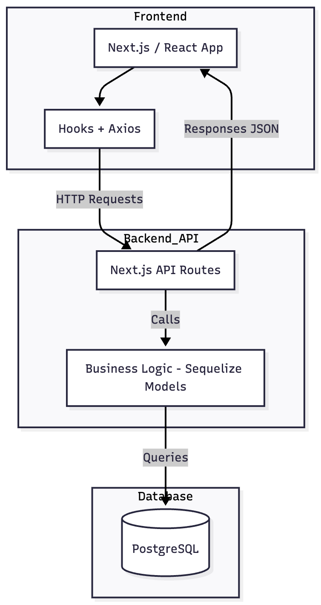
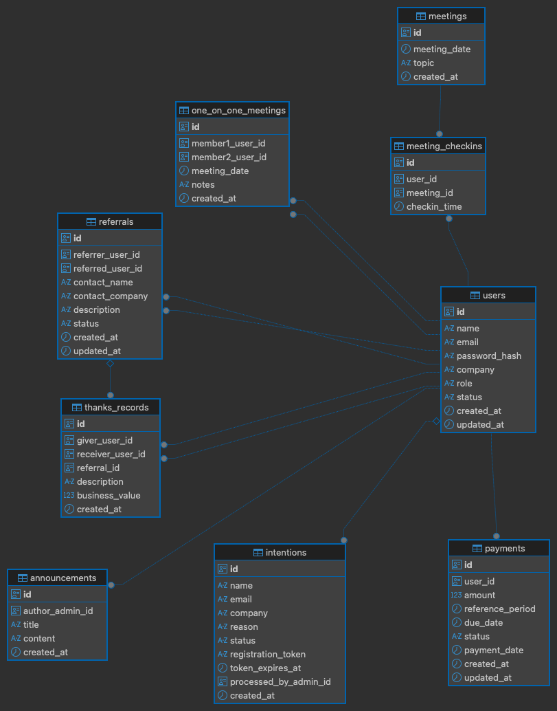

# Documento de Arquitetura: Plataforma de Gestão de Networking

Este documento detalha a visão de arquitetura para a plataforma de gestão de grupos de networking, conforme solicitado no teste técnico.

## 1. Visão Geral e Tecnologias

O objetivo é criar um sistema centralizado para substituir controles manuais, cobrindo desde a admissão de membros até o controle financeiro e de performance.

A stack técnica escolhida para este projeto é:

* **Frontend:** Next.js, React, Tailwind CSS, Phosphor Icons
* **Backend:** Next.js API Routes (Node.js)
* **Banco de Dados:** PostgreSQL
* **ORM:** Sequelize
* **Testes:** Jest, React Testing Library
* **Integração Frontend-API:** hooks customizados fazem chamadas HTTP via Axios para as rotas da API.

## 2. Diagrama da Arquitetura

Este diagrama ilustra os componentes principais da solução e seu fluxo de comunicação.



## 3. Modelo de Dados (PostgreSQL)

O modelo de dados foi projetado para suportar todas as funcionalidades do sistema.



### 3.1. Justificativa da Escolha (PostgreSQL)

A escolha do **PostgreSQL** (um banco de dados SQL) foi feita pelos seguintes motivos:

1. **Natureza Relacional:** O desafio é inerentemente relacional (membros, indicações, pagamentos, reuniões). O Postgres gerencia chaves estrangeiras e relacionamentos complexos de forma robusta.
2. **Integridade dos Dados:** O uso de tipos `ENUM` e `UUIDs`, além de constraints `FOREIGN KEY`, garante que os dados permaneçam limpos e consistentes.
3. **Funcionalidades Avançadas:** O Postgres é excelente para consultas complexas, o que será vital para os Dashboards de Performance e Relatórios.
4. **Escalabilidade:** É uma solução comprovada em produção que pode crescer junto com a plataforma.

### 3.2. Script SQL (Schema Completo)

Abaixo está o script SQL completo para a criação de todos os tipos e tabelas:

```sql
-- Habilita a geração de UUIDs (se ainda não estiver habilitada)
CREATE EXTENSION IF NOT EXISTS "uuid-ossp";

-- ---
-- 1. Criação dos Tipos Personalizados (ENUMs)
-- ---
CREATE TYPE intention_status AS ENUM ('PENDING', 'APPROVED', 'REJECTED');
CREATE TYPE referral_status AS ENUM ('SENT', 'IN_PROGRESS', 'CLOSED_WON', 'CLOSED_LOST');
CREATE TYPE payment_status AS ENUM ('PENDING', 'PAID', 'OVERDUE');
CREATE TYPE user_role AS ENUM ('MEMBER', 'ADMIN');
CREATE TYPE user_status AS ENUM ('ACTIVE', 'INACTIVE');

-- ---
-- 2. Tabela `users` (Membros e Admins)
-- ---
CREATE TABLE users (
    id UUID PRIMARY KEY DEFAULT gen_random_uuid(),
    name VARCHAR(255) NOT NULL,
    email VARCHAR(255) NOT NULL UNIQUE,
    password_hash VARCHAR(255) NOT NULL,
    company VARCHAR(255),
    role user_role NOT NULL DEFAULT 'MEMBER',
    status user_status NOT NULL DEFAULT 'ACTIVE',
    created_at TIMESTAMP WITH TIME ZONE DEFAULT now(),
    updated_at TIMESTAMP WITH TIME ZONE DEFAULT now()
);

-- ---
-- 3. Tabela `intentions` (Intenções de Participação)
-- ---
CREATE TABLE intentions (
    id UUID PRIMARY KEY DEFAULT gen_random_uuid(),
    name VARCHAR(255) NOT NULL,
    email VARCHAR(255) NOT NULL,
    company VARCHAR(255),
    reason TEXT,
    status intention_status NOT NULL DEFAULT 'PENDING',
    registration_token VARCHAR(255) UNIQUE,
    token_expires_at TIMESTAMP WITH TIME ZONE,
    processed_by_admin_id UUID REFERENCES users(id) ON DELETE SET NULL,
    created_at TIMESTAMP WITH TIME ZONE DEFAULT now()
);

-- ---
-- 4. Tabela `referrals` (Indicações de Negócios)
-- ---
CREATE TABLE referrals (
    id UUID PRIMARY KEY DEFAULT gen_random_uuid(),
    referrer_user_id UUID NOT NULL REFERENCES users(id) ON DELETE CASCADE,
    referred_user_id UUID NOT NULL REFERENCES users(id) ON DELETE CASCADE,
    contact_name VARCHAR(255) NOT NULL,
    contact_company VARCHAR(255),
    description TEXT NOT NULL,
    status referral_status NOT NULL DEFAULT 'SENT',
    created_at TIMESTAMP WITH TIME ZONE DEFAULT now(),
    updated_at TIMESTAMP WITH TIME ZONE DEFAULT now()
);

-- ---
-- 5. Tabela `meetings` (Reuniões do Grupo)
-- ---
CREATE TABLE meetings (
    id UUID PRIMARY KEY DEFAULT gen_random_uuid(),
    meeting_date TIMESTAMP WITH TIME ZONE NOT NULL,
    topic VARCHAR(255) NOT NULL,
    created_at TIMESTAMP WITH TIME ZONE DEFAULT now()
);

-- ---
-- 6. Tabela `meeting_checkins` (Presença nas Reuniões)
-- ---
CREATE TABLE meeting_checkins (
    id UUID PRIMARY KEY DEFAULT gen_random_uuid(),
    user_id UUID NOT NULL REFERENCES users(id) ON DELETE CASCADE,
    meeting_id UUID NOT NULL REFERENCES meetings(id) ON DELETE CASCADE,
    checkin_time TIMESTAMP WITH TIME ZONE DEFAULT now(),
    UNIQUE(user_id, meeting_id) -- Garante que um usuário só possa fazer check-in uma vez por reunião
);

-- ---
-- 7. Tabela `payments` (Mensalidades)
-- ---
CREATE TABLE payments (
    id UUID PRIMARY KEY DEFAULT gen_random_uuid(),
    user_id UUID NOT NULL REFERENCES users(id) ON DELETE CASCADE,
    amount DECIMAL(10, 2) NOT NULL,
    reference_period DATE NOT NULL,
    due_date DATE NOT NULL,
    status payment_status NOT NULL DEFAULT 'PENDING',
    payment_date TIMESTAMP WITH TIME ZONE,
    created_at TIMESTAMP WITH TIME ZONE DEFAULT now(),
    updated_at TIMESTAMP WITH TIME ZONE DEFAULT now()
);

-- ---
-- 8. Tabela `announcements` (Avisos e Comunicados)
-- ---
CREATE TABLE announcements (
    id UUID PRIMARY KEY DEFAULT gen_random_uuid(),
    author_admin_id UUID NOT NULL REFERENCES users(id) ON DELETE SET NULL,
    title VARCHAR(255) NOT NULL,
    content TEXT NOT NULL,
    created_at TIMESTAMP WITH TIME ZONE DEFAULT now()
);

-- ---
-- 9. Tabela `thanks_records` ("Obrigados" por Negócios Fechados)
-- ---
CREATE TABLE thanks_records (
    id UUID PRIMARY KEY DEFAULT gen_random_uuid(),
    giver_user_id UUID NOT NULL REFERENCES users(id) ON DELETE SET NULL,
    receiver_user_id UUID NOT NULL REFERENCES users(id) ON DELETE SET NULL,
    referral_id UUID REFERENCES referrals(id) ON DELETE SET NULL,
    description TEXT,
    business_value DECIMAL(10, 2),
    created_at TIMESTAMP WITH TIME ZONE DEFAULT now()
);

-- ---
-- 10. Tabela `one_on_one_meetings` (Reuniões 1 a 1)
-- ---
CREATE TABLE one_on_one_meetings (
    id UUID PRIMARY KEY DEFAULT gen_random_uuid(),
    member1_user_id UUID NOT NULL REFERENCES users(id) ON DELETE CASCADE,
    member2_user_id UUID NOT NULL REFERENCES users(id) ON DELETE CASCADE,
    meeting_date DATE NOT NULL,
    notes TEXT,
    created_at TIMESTAMP WITH TIME ZONE DEFAULT now()
);
```

## 4. Definição da API (REST)

A especificação dos principais endpoints da API que suportarão o fluxo de admissão obrigatório.

### Fluxo de Admissão de Membros

1. **`POST /api/intentions`**
   * **Descrição:** Submete um novo formulário de intenção.
   * **Request Body:** `{ "name": "...", "email": "...", "company": "...", "reason": "..." }`
   * **Response (201):** `{ "success": true, "intentionId": "..." }`

2. **`GET /api/admin/intentions`**
   * **Descrição:** Lista todas as intenções para a área do admin.
   * **Response (200):** `[ { "id": "...", "name": "...", "status": "PENDING", ... } ]`

3. **`PATCH /api/admin/intentions/[id]`**
   * **Descrição:** Aprova ou recusa uma intenção. Na aprovação, gera o token.
   * **Request Body:** `{ "action": "APPROVE" | "REJECT" }`
   * **Response (200):** `{ "success": true, "status": "APPROVED", "registrationLink": "..." }`
   * *Nota: O `registrationLink` será logado no console para simular o envio.*

4. **`GET /api/intentions/validate?token=...`**
   * **Descrição:** Verifica se um token de cadastro é válido.
   * **Response (200):** `{ "valid": true, "email": "..." }`
   * **Response (404):** `{ "valid": false, "error": "Token inválido ou expirado" }`

5. **`POST /api/users/register`**
   * **Descrição:** Cria o novo usuário (membro) após o preenchimento do cadastro completo.
   * **Request Body:** `{ "token": "...", "name": "...", "email": "...", "company": "...", "password": "..." }`
   * **Response (201):** `{ "success": true, "userId": "..." }`

| Método | Endpoint | Finalidade |
| --- | --- | --- |
| `POST` | `/api/intentions` | Receber intenções públicas de participação. |
| `GET` | `/api/admin/intentions` | Listar intenções ordenadas por data para o admin. |
| `PATCH` | `/api/admin/intentions/[id]` | Aprovar ou rejeitar intenção e gerar token. |
| `GET` | `/api/intentions/validate?token=` | Validar token de cadastro enviado ao convidado. |
| `POST` | `/api/users/register` | Criar membro definitivo e limpar token utilizado. |

### Módulo Opcional Escolhido

Optei pela **Opção B - Dashboard de Performance**. A página correspondente está mockada, exibindo indicadores fictícios para demonstrar o layout e a integração futura com dados reais.

## 5. Estrutura de Componentes (Frontend)

A implementação atual não exigiu componentes reutilizáveis adicionais além de `src/components/icons.tsx`, que centraliza os ícones do Phosphor para o frontend. As páginas do App Router consomem diretamente os hooks e estilos. Caso a aplicação cresça, a estrutura planejada segue a divisão abaixo:

- `components/ui/`: componentes visuais puros (botões, inputs, cards).
- `components/features/`: componentes que agrupam lógica de cada fluxo (ex.: formulários de intenção ou listagens de admin).
- `lib/`: hooks customizados e helpers compartilhados.
- `app/`: rotas do Next.js (formulário público, área admin, cadastro com token).

## 6. Bibliotecas Utilizadas

### Dependências
- `axios`
- `bcrypt`
- `next`
- `pg` e `pg-hstore`
- `phosphor-react`
- `react`
- `react-dom`
- `sequelize`

### Dependências de desenvolvimento
- `@tailwindcss/postcss`
- `@testing-library/jest-dom`
- `@testing-library/react`
- `@types/bcrypt`
- `@types/jest`
- `@types/node`
- `@types/pg`
- `@types/react`
- `@types/react-dom`
- `eslint`
- `eslint-config-next`
- `jest`
- `jest-environment-jsdom`
- `tailwindcss`
- `typescript`
```